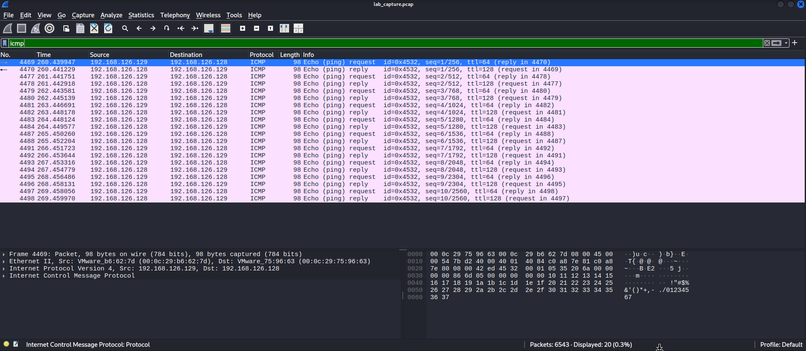
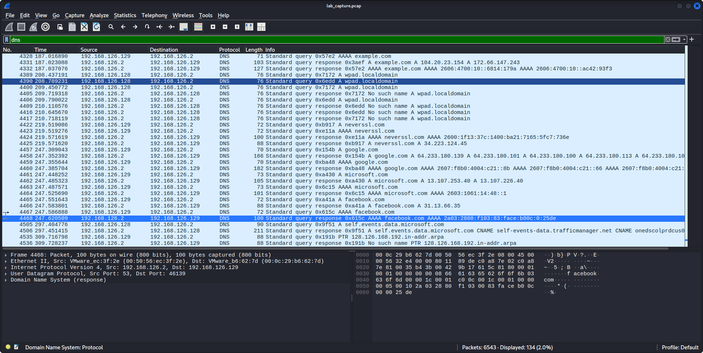
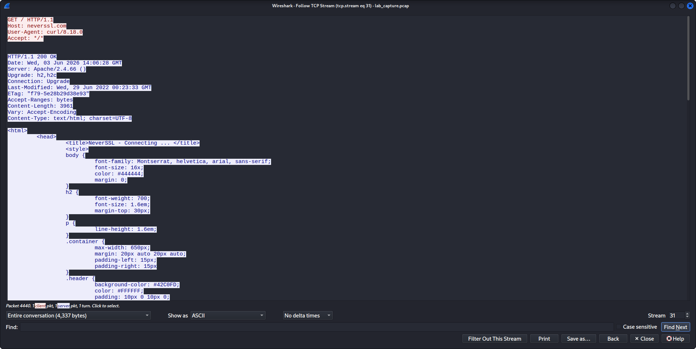
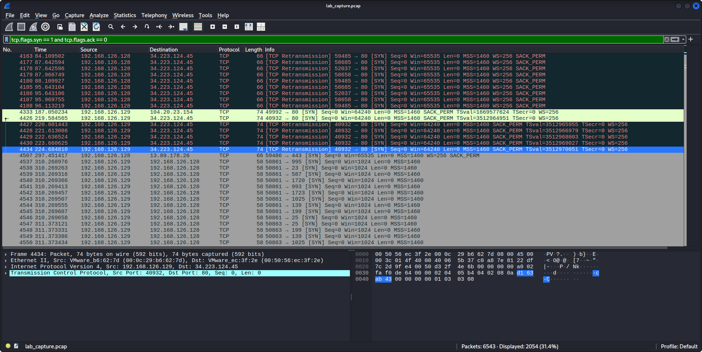
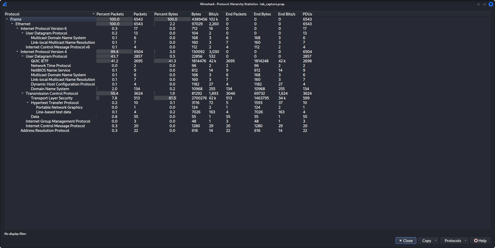

# Network Traffic Analysis — SOC Analyst Portfolio Project


## Overview
A hands-on network traffic analysis lab simulating real SOC analyst
workflows. Packet capture and analysis was performed between a Kali
Linux VM and a Windows 11 VM using tcpdump and Wireshark to identify
suspicious activity, protocol risks, and attacker behavior.

---

## Lab Environment

| Component | Details |
|---|---|
| VM1 — Defender | Kali Linux 2026.1 — 192.168.126.129 |
| VM2 — Target | Windows 11 — 192.168.126.128 |
| Hypervisor | VMware Workstation |
| Capture Interface | eth0 |
| Total Packets Captured | 6,543 |
| Packet Loss | 0% |

---

## Tools Used

| Tool | Purpose |
|---|---|
| tcpdump | Live packet capture to .pcap file |
| Wireshark | Packet analysis, filtering, stream reconstruction |
| Nmap | SYN port scan for traffic generation |
| curl | HTTP request generation |
| nslookup | DNS query generation |
| ping | ICMP traffic and OS fingerprinting |

---

## Findings Summary

| # | Finding | Severity | Protocol | MITRE ATT&CK |
|---|---|---|---|---|
| 1 | OS Fingerprinting via TTL Analysis | Medium | ICMP | T1082 |
| 2 | DNS Query Visibility | Medium | DNS | T1040 |
| 3 | Plaintext HTTP Data Exposure | High | HTTP | T1040 |
| 4 | Port Scan Detected — Nmap SYN Scan | High | TCP | T1046 |
| 5 | Windows Firewall Blocking Confirmed | Info | TCP | M1037 |

---

## Key Screenshots

### Finding 1 — OS Fingerprinting via TTL
Kali sends TTL=64 (Linux), Windows replies TTL=128 (Windows).
Passive OS identification without any specialized tool.



---

### Finding 2 — DNS Query Visibility
All domains queried by both machines visible in plaintext —
including background Windows telemetry traffic.



---

### Finding 3 — Plaintext HTTP Exposure
Full HTTP stream reconstruction showing server software version,
exact timestamp, and complete HTML page content in cleartext.



---

### Finding 4 — Port Scan Detection
2,054 SYN packets targeting 1,000 sequential ports — classic
Nmap SYN scan signature clearly visible in packet capture.



---

### Finding 5 — Protocol Hierarchy
Full protocol breakdown of 6,543 packet capture showing traffic
distribution across TCP, QUIC, TLS, DNS, HTTP, ICMP and ARP.



---

## Key BPF Filters Used

```bash
# Isolate ICMP traffic
icmp

# Isolate DNS queries
dns

# Isolate HTTP traffic
http

# Detect SYN scan signature
tcp.flags.syn == 1 and tcp.flags.ack == 0

# Filter by source IP
ip.src == 192.168.126.129
```

---

## Recommendations

1. Replace all HTTP with HTTPS — enforce TLS 1.2 minimum
2. Deploy DNS over HTTPS to encrypt DNS queries
3. Implement IDS rules to detect SYN scan patterns
4. Normalize TTL values at perimeter to prevent OS fingerprinting
5. Ingest firewall block logs into SIEM for centralized monitoring

---

## Full Report
[SOC Analyst Findings Report](report/SOC_analyst_report.md)

---

*Lab performed in an isolated VMware environment.*
*All findings documented for SOC analyst portfolio purposes.*
